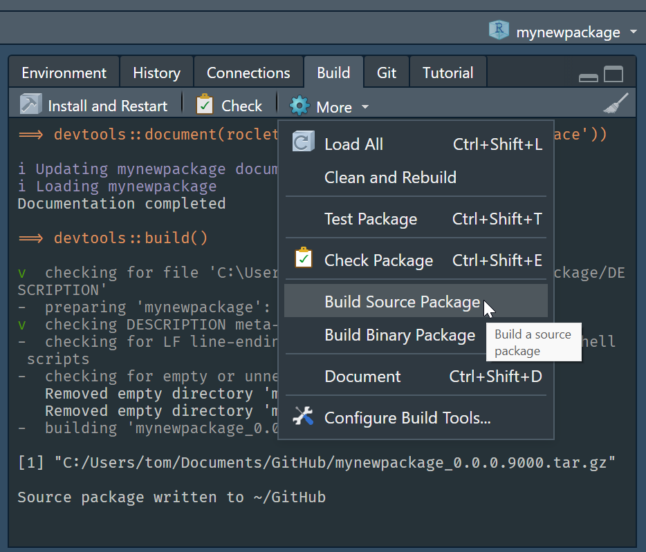
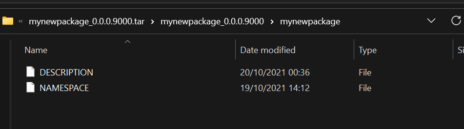

# Create a new package

```{r setup, include=FALSE}
knitr::opts_chunk$set(echo = FALSE, fig.align = "center")
```

- Create a new package by first installing **devtools** and then running
  ```{r, eval=FALSE, echo=TRUE}
  install.packages("devtools")
  devtools::create("mynewpackage")
  ```

- This will generate
  ```
  ✔ Setting active project to '/Users/tom/Documents/GitHub/r-pkg-tips/mynewpackage'
  ✔ Creating 'R/'
  ✔ Writing 'DESCRIPTION'Package: mynewpackage
  Title: What the Package Does (One Line, Title Case)
  Version: 0.0.0.9000
  Authors@R (parsed):
      * First Last <first.last@example.com> [aut, cre] (YOUR-ORCID-ID)
  Description: What the package does (one paragraph).
  License: `use_mit_license()`, `use_gpl3_license()` or friends to
      pick a license
  Encoding: UTF-8
  Roxygen: list(markdown = TRUE)
  RoxygenNote: 7.2.0
  ✔ Writing 'NAMESPACE'
  ✔ Writing 'mynewpackage.Rproj'
  ✔ Adding '^mynewpackage\\.Rproj$' to '.Rbuildignore'
  ✔ Adding '.Rproj.user' to '.gitignore'
  ✔ Adding '^\\.Rproj\\.user$' to '.Rbuildignore'
  ✔ Setting active project to '<no active project>'
  ```
- As seen in RStudio Files pane (nb. even though there is a `.gitignore` file this folder is not initialised as a Git repo yet - look for `.git` folder)  
  ```{r}
  knitr::include_graphics("img/devtools-create.png")
  ```
- Double click the `.Rproj` file to open in RStudio as an RStudio project - this gives you the very helpful Build pane
  ```{r}
  knitr::include_graphics("img/rstudio-mynewpackage.png")
  ```
- If you are working on an existing package define folder/repo as an RStudio project (`.Rproj` file) to get the very helpful Build pane 
  - <https://support.rstudio.com/hc/en-us/articles/200526207-Using-Projects>
  - Key line in the `.Rproj` file is: `BuildType: Package` (`None`/`Package`/`Makefile`/`Website`/`Custom`) - Build pane appears for all but `None`
- Initialise the folder as a Git repo: `usethis::use_git()`
- Now edit/complete the obvious fields in the `DESCRIPTION` file
- Not all of these files will be put into our package, e.g., when we build the source package at the moment only the `DESCRIPTION` and `NAMESPACE` files are included (as our `R` and `man` directories are empty)  
  ```{r}
  
  ```
- To prove the contents of the `.tar.gz` file are currently only  
  ```{r}
  
  ```
