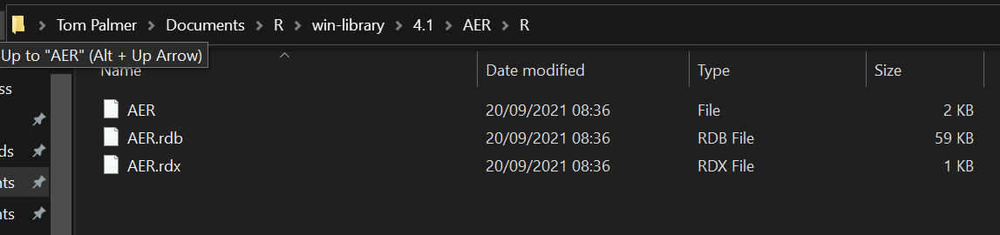

# States

```{r setup, include=FALSE}
knitr::opts_chunk$set(echo = FALSE, fig.align = "center")
```

- Confusingly R packages can be in different states  
  ```{r}
  knitr::include_graphics("img/cran-downloads-example.png")
  ```
- Files change location depending upon state - see [here](https://r-pkgs.org/package-structure-state.html#bundled-package)
- Source - the files you code - what's in your new folder / GitHub repo
- (Source) bundled - the `.tar.gz` file of your source files excluding those in `.Rbuildignore` - what you need to submit to CRAN
- Binary - the 'compiled' version of the bundled package compressed (`.zip` on Windows)
  - the helpfiles converted from `.Rd` to `.html`
  - Vignettes compiled to `.html`
  - any C code etc. will have been compiled
  - `/R` no longer contains `.R` files, now contains 3 files that store the parsed functions in an efficient file format - result of loading all the R code and then saving the functions with `save()`
    ```{r}
    
    ```  
- Installed - the uncompressed zip file in the correct library folder
- In memory - the binary, installed package loaded via `library()`
