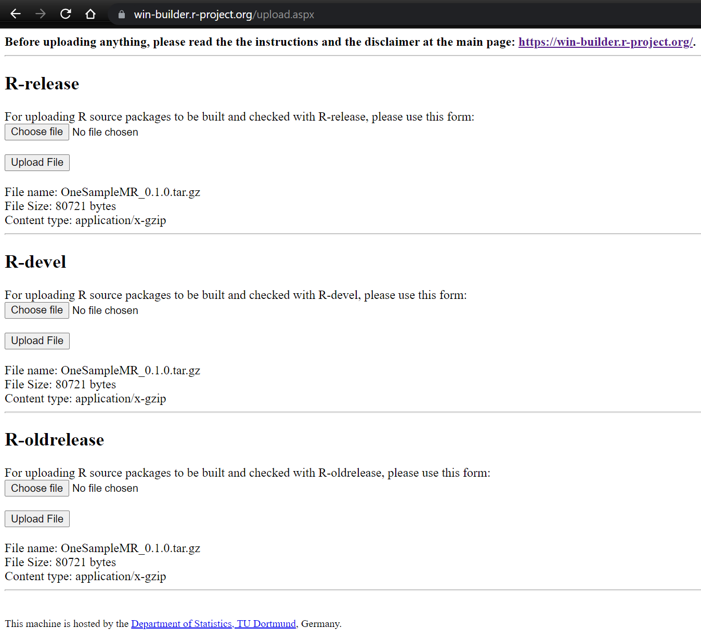

# Checking  
  
- Use `R CMD check`/`devtools::check()`/Check button in RStudio Build pane
- Aim for 0 errors and 0 warnings - this is the minimum requirement for CRAN  
```{r}
knitr::include_graphics('img/r-cmd-check-output.png')
```

- You can setup a GitHub Action to run this on every commit into repo
- `usethis::use_github_action()`/`usethis::use_tidy_github_actions()` or copy from https://github.com/r-lib/actions
- Stata and python have no such similarly thorough checking system, so well worth using
- Think about including tests with [testthat](https://testthat.r-lib.org/) or another testing package
- If your package passes `R CMD check` then you can build a pkgdown website for your package with one command `pkgdown::build_site()`
- Use win-builder for a further check https://win-builder.r-project.org/  
```{r}

```
- For both win-builder and CRAN you will need to submit the source version of your package as a `.tar.gz` file, e.g. in RStudio or issue `R CMD build mynewpackage` at the command line  
  - Note the `.tar.gz` file is what `remotes::install_github()` makes then installs if installing from GitHub  
```{r}
knitr::include_graphics("img/save-as-source-package-output.png")
```
