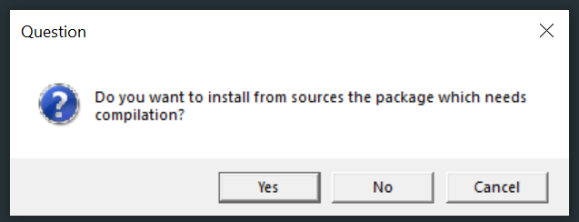

# System dependencies

```{r setup, include=FALSE}
knitr::opts_chunk$set(echo = FALSE, fig.align = "center")
```

- Source R packages are not totally self-contained if external C libraries (or similar) are required to build it as they are not included in the `.tar.gz` file
- To install such a package either download the binary package from CRAN (binary packages for Windows take about 1 day longer to appear after the new source version appears)/RSPM/package manager
  - If you never want this problem always click "No" on this window  
    ```{r out.width="65%"}
    
    ```
- Or, install the required system dependencies on your computer first, e.g. you may see installation failures such as  
  ```
  > install.packages("openssl", type = "source")
  * installing *source* package 'openssl' ...
  ** package 'openssl' successfully unpacked and MD5 sums checked
  Using PKG_CFLAGS=
  ------------------------- ANTICONF ERROR ---------------------------
  Configuration failed because openssl was not found. Try installing:
   * deb: libssl-dev (Debian, Ubuntu, etc)
   * rpm: openssl-devel (Fedora, CentOS, RHEL)
   * csw: libssl_dev (Solaris)
   * brew: openssl@1.1 (Mac OSX)
  If openssl is already installed, check that 'pkg-config' is in your
  PATH and PKG_CONFIG_PATH contains a openssl.pc file. If pkg-config
  is unavailable you can set INCLUDE_DIR and LIB_DIR manually via:
  R CMD INSTALL --configure-vars='INCLUDE_DIR=... LIB_DIR=...'
  --------------------------------------------------------------------
  ERROR: configuration failed for package 'openssl'
  * removing '/usr/local/lib/R/site-library/openssl'
  ```
- Check if a package name is mentioned in the error message. To install it use the following tools for your operating system  
- Windows: 
  - Install [RTools42](https://cran.r-project.org/bin/windows/Rtools/), this provides the [`pacman`](https://github.com/r-windows/docs/blob/master/rtools40.md#system-libraries-and-pacman) system
- macOS: 
  - Install Command Line Tools, issue in the Terminal app
    ```
    xcode-select --install
    ```
  - Most dependencies are available using [Homebrew](https://brew.sh/), e.g.,
    ```
    brew install ...
    ```
- Linux
  - Use the package manager with your distro, e.g. on Ubuntu
    ```
    sudo apt-get install ...
    ```
