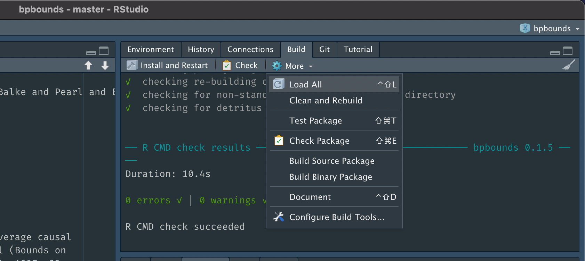
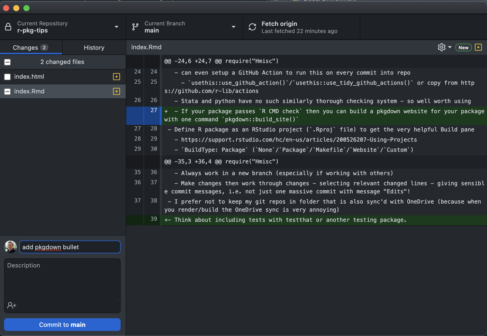

```{r setup, include=FALSE}
require("Hmisc")
knitr::opts_chunk$set(echo = FALSE)
```

`r Hmisc::hidingTOC(levels = 2)`

- Refer to https://r-pkgs.org/ as much as you need to!
- Define R package as an RStudio project (`.Rproj` file) to get the very helpful Build pane 
  - https://support.rstudio.com/hc/en-us/articles/200526207-Using-Projects
  - `BuildType: Package` (`None`/`Package`/`Makefile`/`Website`/`Custom`) - Build pane appears for all but `None`
- Use `R CMD check`/`devtools::check()`/Check button in RStudio Build pane
  - Aim for 0 errors, 0 warnings - this is the minimum requirement for CRAN

    ```{r}
    
    ```

  - You can even setup a GitHub Action to run this on every commit into repo
    - `usethis::use_github_action()`/`usethis::use_tidy_github_actions()` or copy from https://github.com/r-lib/actions
  - Stata and python have no such similarly thorough checking system - so well worth using
  - If your package passes `R CMD check` then you can build a pkgdown website for your package with one command `pkgdown::build_site()`
- Use classes for your functions (S3 easiest system; S4, RC)
  - Under S3 your class probably needs `print`, `summary`, `print.summary` methods, defined as e.g. `print.mynewclass <- function(){...}`
  - Only use dots/periods in your function names if you are coding under the S3 class system
- Use win-builder for a further check https://win-builder.r-project.org/
- Use a visual git editor, e.g. GitHub desktop
  - Always work in a new branch, especially if working with others. Then merge into main/master when you're sure your changes are what you want
  - Make changes then work through changes - selecting relevant changed lines - giving sensible commit messages, i.e. not just one massive commit with message "Edits"!

    ```{r}
    
    ```  
  
- I prefer not to keep my git repos in folder that is also sync'd with OneDrive (because when you render/build the OneDrive sync is very annoying)
- Think about including tests with testthat or another testing package
- When contributing to a new package run `devtools::install_dev_deps()` to install all Depends, Imports, and Suggests packages