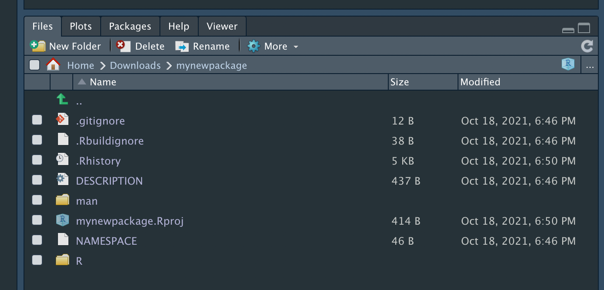
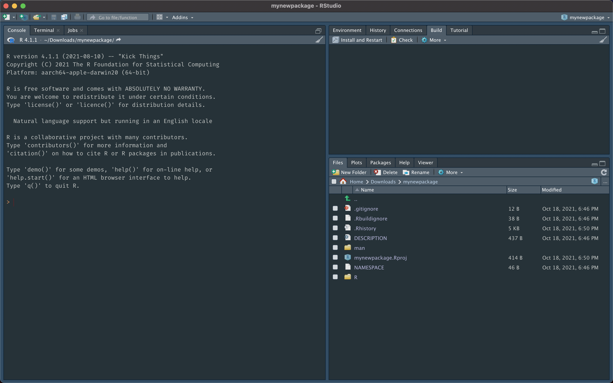
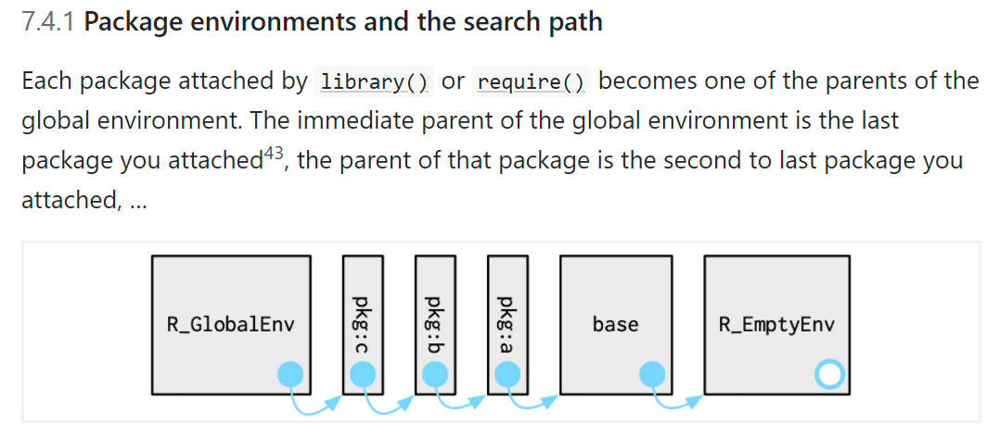
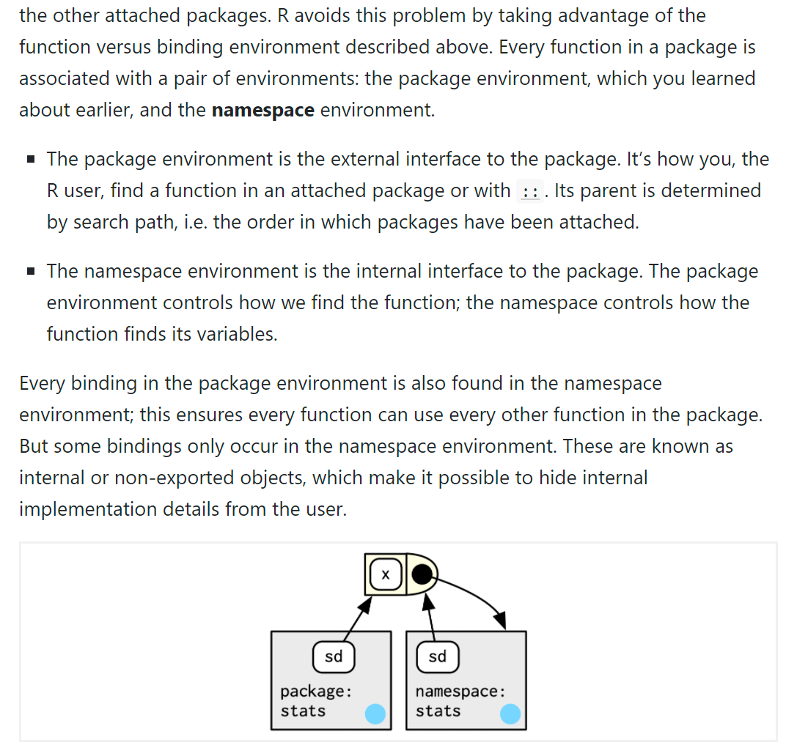
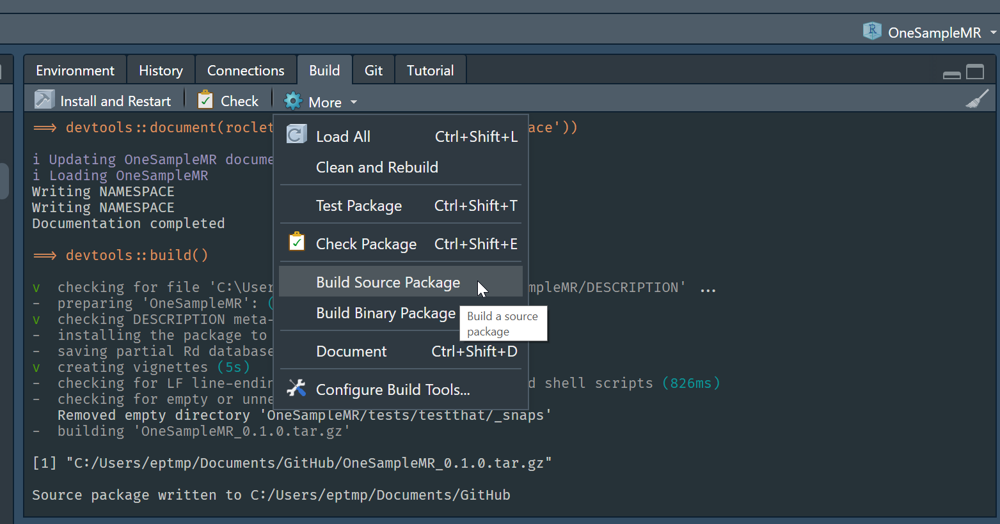
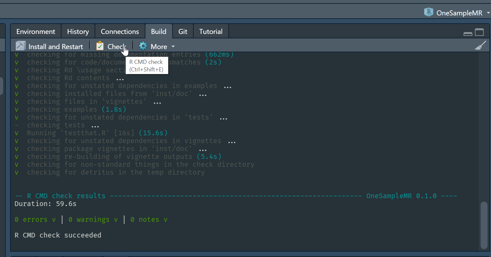

```{r setup, include=FALSE}
require("Hmisc")
knitr::opts_chunk$set(echo = FALSE)
```

<!-- `r Hmisc::hidingTOC(levels = 2)` -->

## {.tabset .tabset-pills} 

### Create

- Create a new package by first installing `devtools` and then running
```{r, eval=FALSE, echo=TRUE}
devtools::create()
```

- This will generate
```{r, eval=FALSE, echo=TRUE}
> devtools::create(path = ".")
✓ Setting active project to '/Users/tom/Downloads/mynewpackage'
✓ Creating 'R/'
✓ Writing 'DESCRIPTION'
Package: mynewpackage
Title: What the Package Does (One Line, Title Case)
Version: 0.0.0.9000
Authors@R (parsed):
    * First Last <first.last@example.com> [aut, cre] OUR-ORCID-ID)
Description: What the package does (one paragraph).
License: `use_mit_license()`, `use_gpl3_license()` or friends to
    pick a license
Encoding: UTF-8
Roxygen: list(markdown = TRUE)
RoxygenNote: 7.1.2
✓ Writing 'NAMESPACE'
✓ Writing 'mynewpackage.Rproj'
✓ Adding '^mynewpackage\\.Rproj$' to '.Rbuildignore'
✓ Adding '.Rproj.user' to '.gitignore'
✓ Adding '^\\.Rproj\\.user$' to '.Rbuildignore'
✓ Setting active project to '<no active project>'
```
- As seen in RStudio File pane
```{r}

```
- Double click the `.Rproj` file to open in RStudio as an RStudio project
```{r}

```
- Initialise the folder as a Git repo: `usethis::use_git()`
- Refer to https://r-pkgs.org/ as much as you need to!
- Another excellent guide is https://kbroman.org/pkg_primer/
- If you are working on an existing package define folder/repo as an RStudio project (`.Rproj` file) to get the very helpful Build pane 
  - https://support.rstudio.com/hc/en-us/articles/200526207-Using-Projects
  - Key line in the `.Rproj` file is: `BuildType: Package` (`None`/`Package`/`Makefile`/`Website`/`Custom`) - Build pane appears for all but `None`

### Classes  
  
- Use classes for your functions (S3 easiest system; S4, RC)
- Under S3 your class probably needs `print`, `summary`, `print.summary` methods, defined as e.g. 
```{r, eval=FALSE, echo=TRUE}
# A function defines a new S3 class
#' @export
myfun <- function(...){
  ...
  class(output) <- "mynewclass"
  output
}

# print method for objects of class mynewclass
#' @export
print.mynewclass <- function(x, digits = max(3, getOption("digits") - 3), ...){
  ...
  invisible(x)
}

# summary method for objects of class mynewclass
#' @export
summary.mynewclass <- function(...){
  ...
  class(output) <- "summary.mynewclass"
  output
}

# print method for objects of class summary.mynewclass
#' @export
print.summary.mynewclass <- function(x, digits = max(3, getOption("digits") - 3),...){
  ...
  invisible(x)  
}
```
- Only use dots/periods in your function names if you are coding under the S3 class system
  
### NAMESPACE
  
- The `NAMESPACE` file is written by devtools when you run `devtools::document()` on your correctly formatted helpfiles
- You must specify to `@export` functions you want exported from your package!
- Remember to `@importFrom pkgname fn` the functions you have used from other packages in the roxygen code before your function
- Read https://r-pkgs.org/namespace.html many times!
- Remember what happens when we load a package - an environment of its objects are placed at the top of R's search path (figure from [here](https://adv-r.hadley.nz/environments.html#special-environments))  
```{r}

```
- Every package has a package environment (the exported functions) and a namespace environment (both exported and internal functions)
```{r}

```
- Use win-builder for a further check https://win-builder.r-project.org/
- For both win-builder and CRAN you will need to submit the source version of your package as a `.tar.gz` file, e.g. in RStudio or issue `R CMD build mynewpackage` at the command line  
```{r}

```

### Checking  
  
- Use `R CMD check`/`devtools::check()`/Check button in RStudio Build pane
- Aim for 0 errors and 0 warnings - this is the minimum requirement for CRAN  
```{r}

```

- You can even setup a GitHub Action to run this on every commit into repo
- `usethis::use_github_action()`/`usethis::use_tidy_github_actions()` or copy from https://github.com/r-lib/actions
- Stata and python have no such similarly thorough checking system, so well worth using
- If your package passes `R CMD check` then you can build a pkgdown website for your package with one command `pkgdown::build_site()`

### Git and GitHub

- Use a visual git editor, e.g. GitHub desktop
- Always work in a new branch, especially if working with others. Then merge into main/master when you're sure your changes are what you want
- Make changes then work through changes 
  - Select relevant changed lines 
  - Use sensible commit messages, i.e. not just one massive commit with message "Edits"!  
```{r}
knitr::include_graphics("img/github-desktop-select-lines.png")
```  
  
- I prefer not to keep my git repositories in a folder that is also synchronized with OneDrive/Google Drive, e.g. when you render an R Markdown file the OneDrive sync of all the auxilliary files that are created can be very annoying
- Think about including tests with testthat or another testing package
- When contributing to a new package run `devtools::install_dev_deps()` to install all packages under Depends, Imports, and Suggests in its `DESCRIPTION` file
- Your repo can contain much more than just your R package
  - Usually will contain the static website for the package (made with pkgdown) and then hosted using GitHub Pages
  - Remember to exclude the files/folders not the package by adding them to the `.Rbuildignore` file

## {-}
