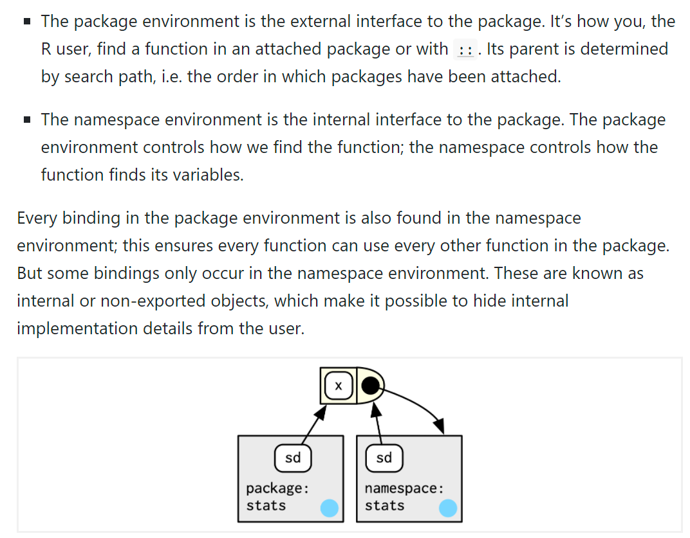
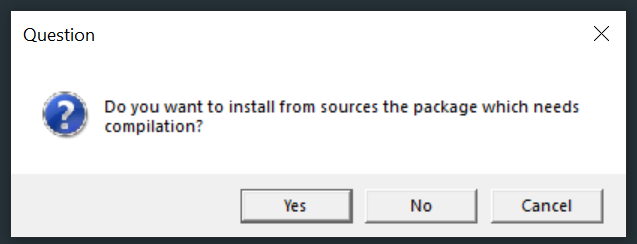

```{r setup, include=FALSE}
require("Hmisc")
knitr::opts_chunk$set(echo = FALSE)
```

<!-- `r Hmisc::hidingTOC(levels = 2)` -->

## Introduction

The following is intended as a set of tips for people coding or about to code an R package.

Extensive guides to writing an R package are given

- at https://r-pkgs.org/ 
- and https://kbroman.org/pkg_primer/

these tips are meant to supplement them.

Also look at the source code of your favourite R packages on GitHub

- https://github.com/rstudio/rmarkdown

## Tips {.tabset .tabset-pills .tabset-fade} 

### Create

- Create a new package by first installing `devtools` and then running
```{r, eval=FALSE, echo=TRUE}
devtools::create()
```

- This will generate
```{r, eval=FALSE, echo=TRUE}
> devtools::create(path = ".")
✓ Setting active project to '/Users/tom/Downloads/mynewpackage'
✓ Creating 'R/'
✓ Writing 'DESCRIPTION'
Package: mynewpackage
Title: What the Package Does (One Line, Title Case)
Version: 0.0.0.9000
Authors@R (parsed):
    * First Last <first.last@example.com> [aut, cre] OUR-ORCID-ID)
Description: What the package does (one paragraph).
License: `use_mit_license()`, `use_gpl3_license()` or friends to
    pick a license
Encoding: UTF-8
Roxygen: list(markdown = TRUE)
RoxygenNote: 7.1.2
✓ Writing 'NAMESPACE'
✓ Writing 'mynewpackage.Rproj'
✓ Adding '^mynewpackage\\.Rproj$' to '.Rbuildignore'
✓ Adding '.Rproj.user' to '.gitignore'
✓ Adding '^\\.Rproj\\.user$' to '.Rbuildignore'
✓ Setting active project to '<no active project>'
```
- As seen in RStudio File pane (nb. even though there is a `.gitignore` file this folder is not initialised as a git repo yet - look for `.git` folder)  
```{r}
knitr::include_graphics("img/devtools-create.png")
```
- Double click the `.Rproj` file to open in RStudio as an RStudio project - this gives you the very helpful Build pane
```{r}
knitr::include_graphics("img/rstudio-mynewpackage.png")
```
- If you are working on an existing package define folder/repo as an RStudio project (`.Rproj` file) to get the very helpful Build pane 
  - https://support.rstudio.com/hc/en-us/articles/200526207-Using-Projects
  - Key line in the `.Rproj` file is: `BuildType: Package` (`None`/`Package`/`Makefile`/`Website`/`Custom`) - Build pane appears for all but `None`
- Initialise the folder as a Git repo: `usethis::use_git()`
- Now edit/complete the obvious fields in the `DESCRIPTION` file
- Not all of these files will be put into our package, e.g., when we build the source package at the moment only the `DESCRIPTION` and `NAMESPACE` files are included (as our `R` and `man` directories are empty)  
```{r}
knitr::include_graphics("img/build-source-pkg-mynewpackage.png")
```
- To prove the contents of the `.tar.gz` file are currently only  
```{r}
knitr::include_graphics("img/source-contents-mynewpackage.png")
```

### States

- Confusingly R packages can be in different states  
```{r}

```
- Files change location depending upon state - see [here](https://r-pkgs.org/package-structure-state.html#bundled-package)
- Source - the files you code - what's in your new folder / GitHub repo
- (Source) bundled - the `.tar.gz` file of your source files excluding those in `.Rbuildignore` - what you need to submit to CRAN
- Binary - the 'compiled' version of the bundled package compressed (`.zip` on Windows)
  - the helpfiles converted from `.Rd` to `.html`
  - Vignettes compiled to `.html`
  - any C code etc. will have been compiled
  - `/R` no longer contains `.R` files, now contains 3 files that store the parsed functions in an efficient file format - result of loading all the R code and then saving the functions with `save()`
    ```{r}
    knitr::include_graphics("img/aer-binary-r-folder.png")
    ```  
- Installed - the uncompressed zip file in the correct library folder
- In memory - the binary, installed package loaded via `library()`

### .R and helpfiles

- `.R` files contain the functions your packge will provide
- Don't code helpfiles (`.Rd` files in the `man` folder) yourself 
- Use Roxygen syntax through the [roxygen2 package](https://github.com/r-lib/roxygen2)
  - Roxygen syntax lines begin `#' `
- To additionally use markdown syntax within roxygen syntax add the following line to your `DESCRIPTION` file
```
Roxygen: list(markdown = TRUE)
```
- Your `.R` files will look something like the following, i.e., roxygen code for the helpfile for a function before the actual R code of the function
```{r, eval=FALSE, echo=TRUE}
#' The length of a string
#'
#' Technically this returns the number of "code points", in a string. One
#' code point usually corresponds to one character, but not always. For example,
#' an u with a umlaut might be represented as a single character or as the
#' combination a u and an umlaut.
#'
#' @inheritParams str_detect
#' @return A numeric vector giving number of characters (code points) in each
#'    element of the character vector. Missing string have missing length.
#' @seealso [stringi::stri_length()] which this function wraps.
#' @export
#' @examples
#' str_length(letters)
#' str_length(NA)
#' str_length(factor("abc"))
#' str_length(c("i", "like", "programming", NA))
str_length <- function(string) {
  ...
}
```
- Running `devtools::document()` will generate your `.Rd` files from your `.R` files

### Classes  
  
- Use classes for your functions (S3 easiest system; S4, RC)
- Under S3 your class probably needs `print`, `summary`, `print.summary` methods, defined as e.g. 
```{r, eval=FALSE, echo=TRUE}
# A function defines a new S3 class
# This function shouldn't really print anything to the R console when run
#' @export
myfun <- function(...){
  ...
  class(output) <- "mynewclass"
  # alternatively given objects can have multiple classes, append your new class
  # class(output) <- append("mynewclass", class(output))
  output
}

# print method for objects of class mynewclass
#' @export
print.mynewclass <- function(x, digits = max(3, getOption("digits") - 3), ...){
  ...
  invisible(x)
}

# summary method for objects of class mynewclass
#' @export
summary.mynewclass <- function(...){
  ...
  class(output) <- "summary.mynewclass"
  output
}

# print method for objects of class summary.mynewclass
#' @export
print.summary.mynewclass <- function(x, digits = max(3, getOption("digits") - 3),...){
  ...
  invisible(x)  
}
```
- I recommend only using dots/periods in your function names if you are coding under the S3 class system

### NAMESPACE
  
- The `NAMESPACE` file is written by devtools when you run `devtools::document()` on your correctly formatted helpfiles
- You must specify to `@export` functions you want exported from your package!
- Remember to `@importFrom pkgname fn` the functions you have used from other packages in the roxygen code before your function
- Read https://r-pkgs.org/namespace.html many times!
- Remember what happens when we load a package - an environment of its objects are placed at the top of R's search path (figure from [here](https://adv-r.hadley.nz/environments.html#special-environments))  
```{r}

```
- Every package has a package environment (the exported functions) and a namespace environment (both exported and internal functions)
```{r}

```

### Checking  
  
- Use `R CMD check`/`devtools::check()`/Check button in RStudio Build pane
- Aim for 0 errors and 0 warnings - this is the minimum requirement for CRAN  
```{r}

```

- You can setup a GitHub Action to run this on every commit into repo
- `usethis::use_github_action()`/`usethis::use_tidy_github_actions()` or copy from https://github.com/r-lib/actions
- Stata and python have no such similarly thorough checking system, so well worth using
- Think about including tests with [testthat](https://testthat.r-lib.org/) or another testing package
- If your package passes `R CMD check` then you can build a pkgdown website for your package with one command `pkgdown::build_site()`
- Use win-builder for a further check https://win-builder.r-project.org/  
```{r}
knitr::include_graphics("img/win-builder-screenshot.png")
```
- For both win-builder and CRAN you will need to submit the source version of your package as a `.tar.gz` file, e.g. in RStudio or issue `R CMD build mynewpackage` at the command line  
  - Note the `.tar.gz` file is what `remotes::install_github()` makes then installs if installing from GitHub  
```{r}
knitr::include_graphics("img/save-as-source-package-output.png")
```

### Git and GitHub

- Use a visual git editor, e.g. [GitHub Desktop](https://desktop.github.com/)
- Work in a new branch, especially if working with others
  - Then merge into main/master when you're sure your changes are what you want
- When coding, I recommend making your changes 
  - Then select relevant changed lines 
  - Use sensible commit messages, i.e., do not make one massive commit with commit message "Edits"!  
```{r}
knitr::include_graphics("img/github-desktop-select-lines.png")
```  
  
- I prefer not to keep my git repositories in a folder which is also synchronized with OneDrive/Google Drive, e.g., when you render an R Markdown file the syncing of all the auxiliary files that are created can be very annoying
- When contributing to a new package, after forking on GitHub, then cloning to your local machine, and opening in RStudio/setting working directory to top level of package run `devtools::install_dev_deps()` to install all packages under Depends, Imports, and Suggests in its `DESCRIPTION` file
- Your repo can contain much more than just your R package
  - It will often additionally contain the static website for the package (made with pkgdown) which can be hosted for free using GitHub Pages/Netlify
  - Remember to exclude the files/folders not the package by adding them to the `.Rbuildignore` file
- Some people don't like others distributing packages through a GitHub repo, because `install_github()` looks for a change in the hash of the latest commit - but that may have been in a file not included in the source package

### System dependencies

- Source R packages are not totally self-contained if external C libraries (or similar) are required to build it as they are not included in the `.tar.gz` file
- To install such a package either download the binary package from CRAN (binary packages for Windows take about 1 day longer to appear after the new source version appears)/RSPM/package manager
  - If you never want this problem always click "No" on this window  
    ```{r}
    
    ```
- Or, install the required system dependencies on your computer first, e.g. you may see installation failures such as  
```
> install.packages("openssl", type = "source")
* installing *source* package 'openssl' ...
** package 'openssl' successfully unpacked and MD5 sums checked
Using PKG_CFLAGS=
------------------------- ANTICONF ERROR ---------------------------
Configuration failed because openssl was not found. Try installing:
 * deb: libssl-dev (Debian, Ubuntu, etc)
 * rpm: openssl-devel (Fedora, CentOS, RHEL)
 * csw: libssl_dev (Solaris)
 * brew: openssl@1.1 (Mac OSX)
If openssl is already installed, check that 'pkg-config' is in your
PATH and PKG_CONFIG_PATH contains a openssl.pc file. If pkg-config
is unavailable you can set INCLUDE_DIR and LIB_DIR manually via:
R CMD INSTALL --configure-vars='INCLUDE_DIR=... LIB_DIR=...'
--------------------------------------------------------------------
ERROR: configuration failed for package 'openssl'
* removing '/usr/local/lib/R/site-library/openssl'
```
- Check if a package name is mentioned in the error message. To install it use the following tools for your operating system  
- Windows: 
  - Install [RTools4](https://cran.r-project.org/bin/windows/Rtools/), this provides the [`pacman`](https://github.com/r-windows/docs/blob/master/rtools40.md#system-libraries-and-pacman) system
- macOS: 
  - Install Command Line Tools, issue in the Terminal app
    ```
    xcode-select --install
    ```
  - Most dependencies are available using [Homebrew](https://brew.sh/), e.g.,
    ```
    brew install ...
    ```
- Linux
  - Use the package manager with your distro, e.g.
    ```
    sudo apt-get install ...
    ```

## {-}
